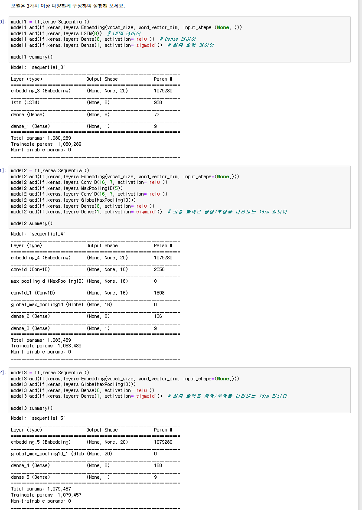
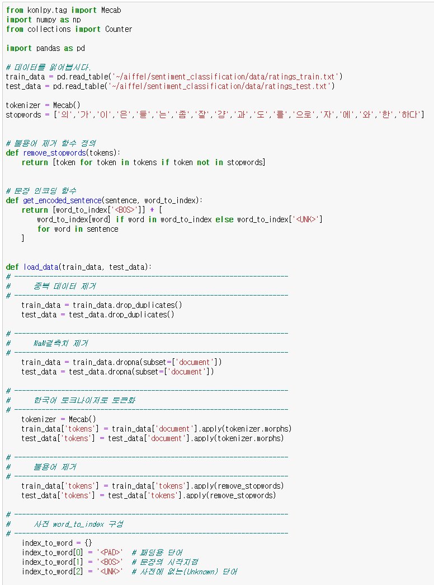
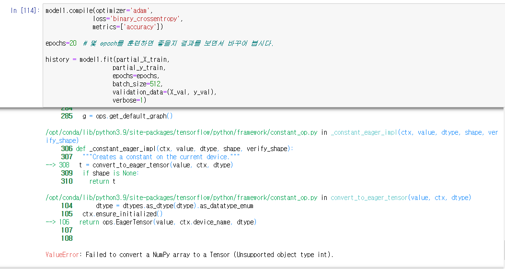
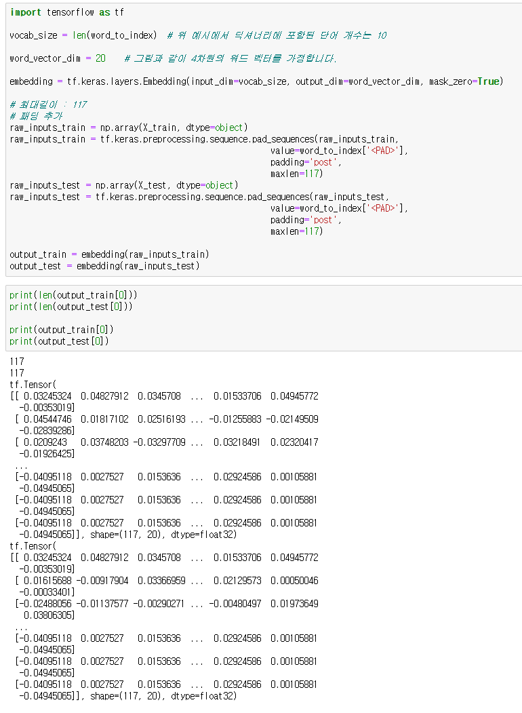

# AIFFEL Campus Online Code Peer Review Templete
- 코더 : 유지훈
- 리뷰어 : 김영민


# PRT(Peer Review Template)
- [ ]  **1. 주어진 문제를 해결하는 완성된 코드가 제출되었나요?**
    - 문제에서 요구하는 최종 결과물이 첨부되었는지 확인
        - 중요! 해당 조건을 만족하는 부분을 캡쳐해 근거로 첨부
        - 미완성입니다.
        - 모델은 lstm, conv1d, global max pooling을 활용한 총 3개의 모델이 있습니다.
        - 그 외 임베딩 레이어 분석 및 word2vec을 통한 성능향상은 없습니다.
        
    
- [x]  **2. 전체 코드에서 가장 핵심적이거나 가장 복잡하고 이해하기 어려운 부분에 작성된 
주석 또는 doc string을 보고 해당 코드가 잘 이해되었나요?**
    - 해당 코드 블럭을 왜 핵심적이라고 생각하는지 확인
    - 해당 코드 블럭에 doc string/annotation이 달려 있는지 확인
    - 해당 코드의 기능, 존재 이유, 작동 원리 등을 기술했는지 확인
    - 주석을 보고 코드 이해가 잘 되었는지 확인
        - 중요! 잘 작성되었다고 생각되는 부분을 캡쳐해 근거로 첨부
        - 주석도 잘 적혀있고 중복 및 결측치를 잘 제거했습니다.
        

        
- [x]  **3. 에러가 난 부분을 디버깅하여 문제를 해결한 기록을 남겼거나
새로운 시도 또는 추가 실험을 수행해봤나요?**
    - 문제 원인 및 해결 과정을 잘 기록하였는지 확인
    - 프로젝트 평가 기준에 더해 추가적으로 수행한 나만의 시도, 
    실험이 기록되어 있는지 확인
        - 중요! 잘 작성되었다고 생각되는 부분을 캡쳐해 근거로 첨부
        - 파일 마지막 코드셀의 모델 컴파일 부분에서 에러가 난 부분이 있었고 고치려는 흔적이 있습니다.
        - 리뷰전까지 고치지는 못했으나 이 에러에서 많은 고민을 했습니다.
        
```
ValueError: Failed to convert a NumPy array to a Tensor (Unsupported object type int).
```
        
- [ ]  **4. 회고를 잘 작성했나요?**
    - 주어진 문제를 해결하는 완성된 코드 내지 프로젝트 결과물에 대해
    배운점과 아쉬운점, 느낀점 등이 기록되어 있는지 확인
    - 전체 코드 실행 플로우를 그래프로 그려서 이해를 돕고 있는지 확인
        - 중요! 잘 작성되었다고 생각되는 부분을 캡쳐해 근거로 첨부
        - 회고가 없습니다.
        - 주석이 플로우처럼 구성되어 있어서 코드 진행이 한눈에 들어옵니다.
        
        
- [x]  **5. 코드가 간결하고 효율적인가요?**
    - 파이썬 스타일 가이드 (PEP8) 를 준수하였는지 확인
    - 코드 중복을 최소화하고 범용적으로 사용할 수 있도록 함수화/모듈화했는지 확인
        - 중요! 잘 작성되었다고 생각되는 부분을 캡쳐해 근거로 첨부
        - print문을 통해 중간중간 변수의 값을 계속 확인하면서 효율적인 디버깅을 하고 있습니다.
        - 주석을 읽기 좋게 구성하여 코드 가독성이 좋습니다.
        
        
```
def load_data(train_data, test_data):
# ----------------------------------------------------------------------
#      중복 데이터 제거
# ----------------------------------------------------------------------
    train_data = train_data.drop_duplicates()
    test_data = test_data.drop_duplicates()
    
# ----------------------------------------------------------------------
#      NaN결측치 제거
# ----------------------------------------------------------------------
    train_data = train_data.dropna(subset=['document'])
    test_data = test_data.dropna(subset=['document'])
    
# ----------------------------------------------------------------------
#      한국어 토크나이저로 토큰화
# ----------------------------------------------------------------------
    tokenizer = Mecab()
    train_data['tokens'] = train_data['document'].apply(tokenizer.morphs)
    test_data['tokens'] = test_data['document'].apply(tokenizer.morphs)
    
# ----------------------------------------------------------------------
#      불용어 제거
# ----------------------------------------------------------------------
    train_data['tokens'] = train_data['tokens'].apply(remove_stopwords)
    test_data['tokens'] = test_data['tokens'].apply(remove_stopwords)
    
# ----------------------------------------------------------------------
#      사전 word_to_index 구성
# ----------------------------------------------------------------------
    index_to_word = {}
    index_to_word[0] = '<PAD>'  # 패딩용 단어
    index_to_word[1] = '<BOS>'  # 문장의 시작지점
    index_to_word[2] = '<UNK>'  # 사전에 없는(Unknown) 단어

    # 리스트 컴프리헨션으로 모든 리스트의 문자열 데이터를 하나의 리스트에 담음
    all_tokens = [token for tokens in train_data['tokens'] for token in tokens]

    # 중복 제거 및 리스트 변환 (한 번만 실행)
    all_tokens_list = list(set(all_tokens))

    # 인덱싱
    for i, token in enumerate(all_tokens_list, start=3):
        index_to_word[i] = token

    # word_to_index
    word_to_index = {word:index for index, word in index_to_word.items()}
    
# ----------------------------------------------------------------------
#      텍스트 스트링을 사전 인덱스 스트링으로 변환
# ----------------------------------------------------------------------    
    
    # 적용
    train_data['encoded_sentence'] = train_data['tokens'].apply(
        lambda tokens: get_encoded_sentence(tokens, word_to_index)
    )
    # 적용
    test_data['encoded_sentence'] = test_data['tokens'].apply(
        lambda tokens: get_encoded_sentence(tokens, word_to_index)
    )
    
# ----------------------------------------------------------------------
#      X_train, y_train, X_test, y_test, word_to_index 리턴
# ----------------------------------------------------------------------
    X_train = train_data['encoded_sentence']
    y_train = train_data['label']
    X_test = test_data['encoded_sentence']
    y_test = test_data['label']
    
    return X_train, y_train, X_test, y_test, word_to_index
```


# 회고(참고 링크 및 코드 개선)
```
# 리뷰어의 회고를 작성합니다.
# 코드 리뷰 시 참고한 링크가 있다면 링크와 간략한 설명을 첨부합니다.
# 코드 리뷰를 통해 개선한 코드가 있다면 코드와 간략한 설명을 첨부합니다.
```
- 훈련된 모델과 결과가 잘 나오길 바랍니다.
- 주석이 인상깊었습니다.